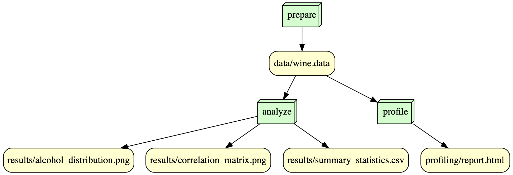

## Overview
This project is for the IS477 Fall 2023 course and is about doing a detailed analysis of the Wine Recognition Dataset from the UCI Machine Learning Repository. It has data from a chemical analysis of wines from Italy, coming from three different types of grapes. The analysis looked into 13 different chemical parts in each wine type.
We're going to dig into this dataset with various analysis methods. There are 178 samples in the dataset, and it covers 13 features like Alcohol, Malic Acid, Ash, and others. We want to see how these chemicals are related and how they can help tell the wine types apart.
The project, called is477-fall2023-final-project, has scripts for data processing, analysis, and making graphs. The prepare_data.py script downloads and sets up the dataset. Then, the profile.py script uses ydata-profiling to make a detailed report, giving us a good first look at the dataset. The analysis.py script does stuff like calculating summary statistics and making graphs, similar to what we did in previous assignments. All the results go into the results/ folder.
This project isn't just for our class; it's also useful for understanding how data analysis can help in real world stuff, like learning about different kinds of wine.

## Analysis 

Looking at the alcohol content histogram from the Wine dataset, it seems like it's mostly a normal distribution, with most wines having an alcohol percentage between 12.5% and 13.5%. This means that a lot of the wines in this dataset are around this alcohol range.
The correlation matrix gives us a look at how different chemical properties in the wines are related to each other, like alcohol, malic acid, ash, and others. When the correlation numbers are really high or low, it means there's a strong connection between those chemicals. For example, flavonoids and total phenols have a high positive correlation, meaning they usually increase together. But, flavonoids have a strong negative correlation with the class of the wine, which suggests that the amount of flavonoids can help tell different kinds of wine apart.
These graphs and numbers are pretty handy for people who make wine or are really into wine. They give a good idea of the chemical makeup of different wines and how certain things in the wine can affect its quality or how you can classify it.

## Workflow

## Reproducing

1. Check the environment set up by looking into environment.log before execution of the codes.

2. Install the required python packages by using this code "pip install -r requirements.txt"

3. Running the Codes: 
Process to Download the Datafile and check if the file is valid: run "prepare_data.py"

Reproducing - run these codes: "profile.py" , "analysis.py"

## License

Workflow License: MIT License
Data Liscense: Creative Commons Attribution 4.0 International (CC BY 4.0)

## References

Wine Dataset: Aeberhard,Stefan and Forina,M.. (1991). Wine. UCI Machine Learning Repository. https://doi.org/10.24432/C5PC7J.

## Zenodo
Zenodo DOI Badge: 